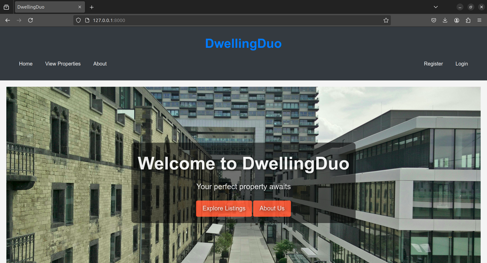

# Dwelling Duo 🏡

**Dwelling Duo** is a web application developed using Django that allows users to list, search, and filter properties for sale or rent. The application features user authentication, property management, and dynamic search functionalities, enhancing the user experience.

## Deployed Site 🌐
Check out the live version of the application [here](https://youtu.be/TwY8yHKNfnI?si=rBD6gzaAPcplXktA).

## Final Project Blog Article 📝
You can read more about this project in my [final blog article](https://medium.com/@johnrika/my-journey-in-building-dwellingduo-a-property-listing-platform-2d8586abfbfc).

## Author Links 🔗
- [LinkedIn](https://www.linkedin.com/in/john-rika/)
- [GitHub](https://github.com/jayricka)

## Screenshot 📸


## Table of Contents

- [Features](#features)
- [Technologies Used](#technologies-used)
- [Installation](#installation)
- [Usage](#usage)
- [Contributing](#contributing)
- [License](#license)
- [Contact](#contact)

## Features ✨

- 🔐 **User Authentication**: Registration, login, logout functionality
- 🏡 **Property Management**: Create, update, and delete property listings
- 🔍 **Search & Filter**: Search properties by title, price range, location, and availability
- ⚡ **Dynamic Filtering**: AJAX-based search for a seamless experience
- 📱 **Responsive Design**: Optimized for both mobile and desktop

## Technologies Used 🛠️

- **Backend**: Python, Django
- **Frontend**: HTML, CSS, JavaScript (AJAX for dynamic functionality)
- **Database**: MySQL
- **Environment**: SQLite (development)

## Installation

To get started with the project, follow these steps:

1. **Clone the repository:**

   ```bash
   git clone https://github.com/jayricka/dwelling-duo.git
   cd dwelling-duo
2. **Setup a virtual Environment:**

## Installation Steps

### Set up a virtual environment:

    ```bash
    python -m venv env
    source env/bin/activate  # On Windows use `env\Scripts\activate`

### Install dependencies

    ```bash
    pip install -r requirements.txt

### Access the Application

Open your web browser and navigate to [http://127.0.0.1:8000/](http://127.0.0.1:8000/).

## Usage 💻

- 📝 Register a new account or log in with an existing account.
- 🏡 Create a new property listing via the dashboard.
- 🔍 Use the search bar to filter properties by title, price range, location, and availability.
- 📋 Click on a property listing to view its details.
- Admin users can manage properties via the admin panel. (&#x1F469;&#x200D;&#x1F4BC;)

## Contributing 🤝

Contributions are welcome! If you want to contribute to DwellingDuo, please follow these steps:

1. Fork the repository.
2. Create a new branch:
   ```bash
   git checkout -b feature-branch

## License 📜

This project is licensed under the MIT License. See the LICENSE file for details.
